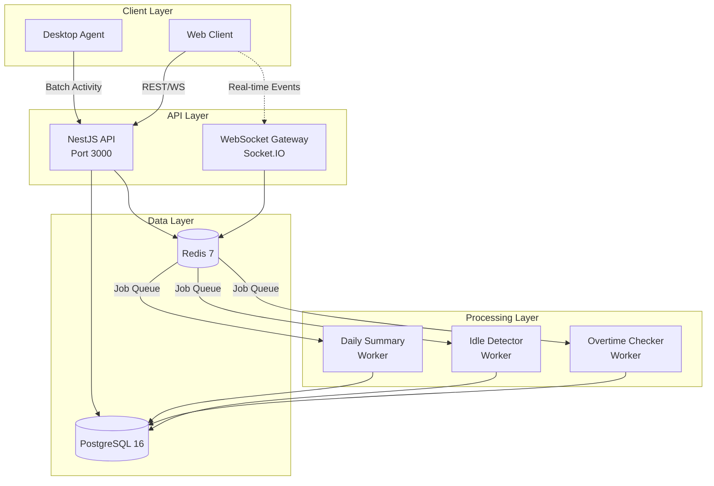
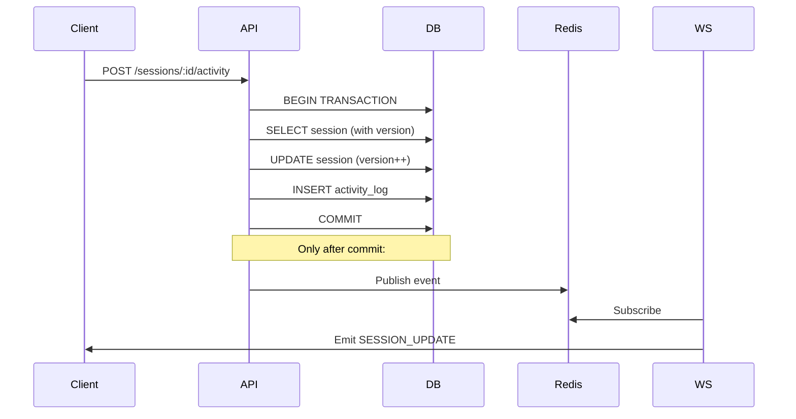

# WorkPulse

> **Production-grade multi-tenant workforce productivity SaaS platform**

Real-time workforce monitoring and time intelligence system built with NestJS, PostgreSQL, Redis, and Socket.IO.

## 🎯 Key Features

✅ **Multi-tenant Architecture** - Secure organization-level data isolation  
✅ **Real-time Monitoring** - WebSocket-based presence and activity tracking  
✅ **Concurrency-Safe** - Optimistic locking prevents data corruption  
✅ **Background Processing** - BullMQ workers for daily summaries and alerts  
✅ **Production-Ready** - Docker deployment with health checks and graceful shutdown  
✅ **Scalable** - Horizontal scaling support for API and workers  

---

## 🏗 Architecture



---

## 📊 Database Schema

### Tables

**7 Core Tables:**

1. **organizations** - Multi-tenant organization data
2. **users** - User accounts with role-based access
3. **projects** - Work projects for time tracking
4. **work_sessions** - Active/stopped work sessions with optimistic locking
5. **activity_logs** - High-volume activity tracking (designed for partitioning)
6. **daily_summaries** - Aggregated productivity metrics
7. **alerts** - Idle and overtime notifications

### Multi-Tenant Isolation

All user data tables include `organization_id` with proper indexes:
- `(organization_id, email)` unique constraint on users
- Foreign key cascades for data cleanup
- Row-level security ready

---

## 🔐 Concurrency & Locking Strategy

### Why Optimistic Locking?

**Problem:** Multiple activity logs updating the same session simultaneously can cause lost updates.

**Solution:** TypeORM's `@VersionColumn()` on `work_sessions` table.

### How It Works

```typescript
@Entity()
class WorkSession {
  @VersionColumn()
  version: number; // Auto-incremented on each update
}
```

**Process:**
1. Read session with current version (e.g., `version = 5`)
2. Update session totals
3. Save with `WHERE id = ? AND version = 5`
4. If another request updated first, `OptimisticLockVersionMismatchError` thrown
5. Retry with exponential backoff (3 attempts max)

**Result:** No lost updates, no blocking locks, high throughput.

---

## 🌐 Real-Time Event Flow



**Critical Rule:** Events emitted **only after DB commit** to prevent inconsistent state.

---

## 🧵 Background Jobs (BullMQ)

### 1. Daily Summary Generator

**Schedule:** Midnight (00:00) per timezone  
**Idempotency:** `UPSERT` with `(user_id, date)` constraint

```sql
INSERT INTO daily_summaries (user_id, date, ...)
ON CONFLICT (user_id, date)
DO UPDATE SET ...
```

### 2. Idle Detector

**Frequency:** Every 1 minute  
**Logic:** Finds sessions with `last_activity_at < NOW() - 5 minutes`  
**Idempotency:** Checks if alert already exists for session today

### 3. Overtime Checker

**Frequency:** Every 30 minutes  
**Threshold:** > 9 hours worked  
**Idempotency:** One alert per user per day

**Configuration:**
- Retry: 3 attempts with exponential backoff
- Auto-clean: Completed jobs after 24h
- Graceful shutdown: Waits for active jobs

---

## 🚀 Quick Start

### Prerequisites

- Docker & Docker Compose
- Node.js 20+ (for local development)

### Run with Docker (Recommended)

```bash
# Clone repository
git clone <repo-url>
cd workpulse

# Copy environment file
cp .env.example .env

# IMPORTANT: Change JWT_SECRET in production!
# Edit .env and set a strong JWT_SECRET

# Start all services
docker-compose up --build

# API available at http://localhost:3000
# Health check: http://localhost:3000/health
```

**Services Started:**
- PostgreSQL 16 (port 5432)
- Redis 7 (port 6379)
- API Server (port 3000)
- Background Worker

---

## 📋 API Endpoints

### Authentication

```http
POST /auth/register
Content-Type: application/json

{
  "email": "user@example.com",
  "password": "strongpassword123",
  "name": "John Doe",
  "organization_id": "uuid",
  "role": "employee"
}

Response: { "user": {...}, "access_token": "jwt..." }
```

```http
POST /auth/login
Content-Type: application/json

{
  "email": "user@example.com",
  "password": "strongpassword123",
  "organization_id": "uuid"
}

Response: { "user": {...}, "access_token": "jwt..." }
```

### Sessions

```http
POST /sessions/start
Authorization: Bearer <token>
Content-Type: application/json

{
  "project_id": "uuid" // optional
}
```

```http
POST /sessions/:id/stop
Authorization: Bearer <token>
```

```http
GET /sessions/active
Authorization: Bearer <token>
```

### Activity Logging

**Single Activity:**
```http
POST /sessions/:id/activity
Authorization: Bearer <token>
Content-Type: application/json

{
  "activityType": "active",
  "durationSeconds": 60,
  "appName": "VS Code",
  "url": "file:///project/main.ts"
}
```

**Batch Activity (Desktop Agent):**
```http
POST /activity/batch
Authorization: Bearer <token>
Content-Type: application/json

{
  "sessionId": "uuid",
  "events": [
    {
      "timestamp": "2024-02-11T10:00:00Z",
      "activityType": "active",
      "durationSeconds": 120,
      "appName": "Chrome"
    },
    ...
  ]
}
```

### Health

```http
GET /health

Response:
{
  "status": "ok",
  "info": {
    "database": { "status": "up" },
    "redis": { "status": "up" }
  }
}
```

---

## 🌐 WebSocket Events

### Connection

```javascript
import io from 'socket.io-client';

const socket = io('http://localhost:3000', {
  auth: {
    token: 'your-jwt-token'
  }
});

socket.on('connect', () => {
  console.log('Connected');
});
```

### Events Received

- `USER_ONLINE` - User connected
- `USER_OFFLINE` - User disconnected
- `SESSION_UPDATE` - Session state changed
- `INACTIVE_ALERT` - User idle > 5 minutes
- `OVERTIME_ALERT` - Work time > 9 hours

**Example:**
```javascript
socket.on('SESSION_UPDATE', (data) => {
  console.log('Session updated:', data.session);
});

socket.on('INACTIVE_ALERT', (data) => {
  console.log('User idle:', data.message);
});
```

---

## 🧪 Load Testing

### Concurrency Test

Tests optimistic locking by sending 100 parallel activity requests:

```bash
# Start the API first
docker-compose up -d

# Install test dependencies
npm install axios pg

# Run test
node test/test-activity-load.js
```

**Expected Output:**
```
=== WorkPulse Concurrency Load Test ===

1. Registering user...
✓ User registered successfully

2. Starting work session...
✓ Session started successfully

3. Sending 100 parallel activity requests...
✓ Completed in 1234ms
  Successful: 100

4. Verifying final totals...
Expected total: 6000 seconds
Actual total: 6000 seconds

✓✓✓ SUCCESS! No double-counting detected!
```

---

## 🔧 Local Development

```bash
# Install dependencies
npm install

# Set up environment
cp .env.example .env

# Start PostgreSQL and Redis
docker-compose up -d postgres redis

# Run migrations
npm run build
npm run migration:run

# Start API in watch mode
npm run start:dev

# Start worker in watch mode (separate terminal)
npm run start:worker
```

---

## 📦 Production Deployment

### Environment Variables

**Critical settings for production:**

```bash
# Generate a strong secret (32+ characters)
JWT_SECRET=your-super-secret-production-key-here

# Database (use managed PostgreSQL)
DATABASE_HOST=prod-db.example.com
DATABASE_PASSWORD=strong-db-password

# Redis (use managed Redis)
REDIS_HOST=prod-redis.example.com

# Set production mode
NODE_ENV=production
LOG_LEVEL=info
```

### Scaling

**Horizontal Scaling:**
- Run multiple API containers behind load balancer
- Run multiple worker containers for job processing
- Use managed PostgreSQL with read replicas
- Use Redis Cluster for high availability

**Vertical Scaling:**
- Increase worker concurrency in BullMQ
- Optimize database indexes
- Enable PostgreSQL connection pooling

---

## 🎨 Design Trade-offs

### 1. Integer Seconds vs Milliseconds
**Decision:** Integer seconds  
**Rationale:** Simpler aggregation, sufficient for productivity tracking  
**Trade-off:** Less precision for micro-benchmarking

### 2. Optimistic vs Pessimistic Locking
**Decision:** Optimistic locking  
**Rationale:** Better throughput, conflicts are rare  
**Trade-off:** Client must handle 409 Conflict responses

### 3. Migrations vs Auto-Sync
**Decision:** Migrations only (`synchronize: false`)  
**Rationale:** Production safety, version-controlled schema  
**Trade-off:** Manual migration management

### 4. Event Emission Timing
**Decision:** Emit only after DB commit  
**Rationale:** Prevents inconsistent state  
**Trade-off:** Slight delay in real-time events

### 5. Activity Logs Design
**Decision:** Designed for time-based partitioning  
**Rationale:** High volume, efficient queries by date  
**Trade-off:** Requires PostgreSQL partition management

---

## 📚 Tech Stack

- **Framework:** NestJS 10
- **Database:** PostgreSQL 16
- **Caching/Queue:** Redis 7
- **ORM:** TypeORM (migrations only)
- **Jobs:** BullMQ
- **WebSocket:** Socket.IO
- **Auth:** JWT + bcrypt
- **Logging:** Pino (JSON)
- **Validation:** class-validator
- **Deployment:** Docker multi-stage builds

---

## 🛡 Security

✅ JWT authentication on all protected routes  
✅ Password hashing with bcrypt (12 rounds)  
✅ Input validation with class-validator  
✅ SQL injection prevention via TypeORM parameterized queries  
✅ Multi-tenant data isolation via organization_id  
✅ Non-root Docker user  
✅ CORS enabled (configure origins for production)

---

## 📖 Project Structure

```
src/
├── main.ts                    # API entry point
├── worker.ts                  # Background worker entry
├── app.module.ts              # Root module
├── config/                    # Configuration files
│   ├── database.config.ts
│   ├── redis.config.ts
│   ├── jwt.config.ts
│   ├── logger.config.ts
│   └── typeorm.config.ts
├── entities/                  # Database entities (7 tables)
│   ├── organization.entity.ts
│   ├── user.entity.ts
│   ├── project.entity.ts
│   ├── work-session.entity.ts
│   ├── activity-log.entity.ts
│   ├── daily-summary.entity.ts
│   └── alert.entity.ts
├── modules/
│   ├── auth/                  # Authentication & JWT
│   ├── sessions/              # Session management
│   ├── activity/              # Activity ingestion
│   ├── websocket/             # Socket.IO gateway
│   ├── jobs/                  # BullMQ workers
│   └── health/                # Health checks
├── common/
│   ├── decorators/
│   ├── filters/
│   ├── guards/
│   ├── interceptors/
│   └── pipes/
└── migrations/                # Database migrations
    └── 1707000000000-InitialSchema.ts

test/
└── test-activity-load.js      # Concurrency load test
```

---

## 🐛 Troubleshooting

### Database Connection Failed

```bash
# Check PostgreSQL is running
docker-compose ps postgres

# View logs
docker-compose logs postgres

# Verify connection
docker-compose exec postgres psql -U workpulse -d workpulse_db
```

### Redis Connection Failed

```bash
# Check Redis is running
docker-compose ps redis

# Test connection
docker-compose exec redis redis-cli ping
```

### Migration Errors

```bash
# Drop database and recreate (DEV ONLY!)
docker-compose down -v
docker-compose up -d postgres
docker-compose exec api npm run migration:run
```

---

## 📄 License

MIT License - See LICENSE file for details

---

## 🤝 Contributing

1. Fork the repository
2. Create feature branch (`git checkout -b feature/amazing-feature`)
3. Commit changes (`git commit -m 'Add amazing feature'`)
4. Push to branch (`git push origin feature/amazing-feature`)
5. Open Pull Request

---

## 🎯 Production Checklist

- [ ] Change `JWT_SECRET` to a strong random value
- [ ] Use managed PostgreSQL database
- [ ] Use managed Redis instance
- [ ] Configure SSL/TLS certificates
- [ ] Set up log aggregation (ELK, Datadog)
- [ ] Configure monitoring and alerts
- [ ] Set up automated backups
- [ ] Configure CORS origins whitelist
- [ ] Enable rate limiting
- [ ] Set up CI/CD pipeline
- [ ] Configure secrets management (Vault, AWS Secrets Manager)

---

Built with ❤️ using NestJS and TypeScript
