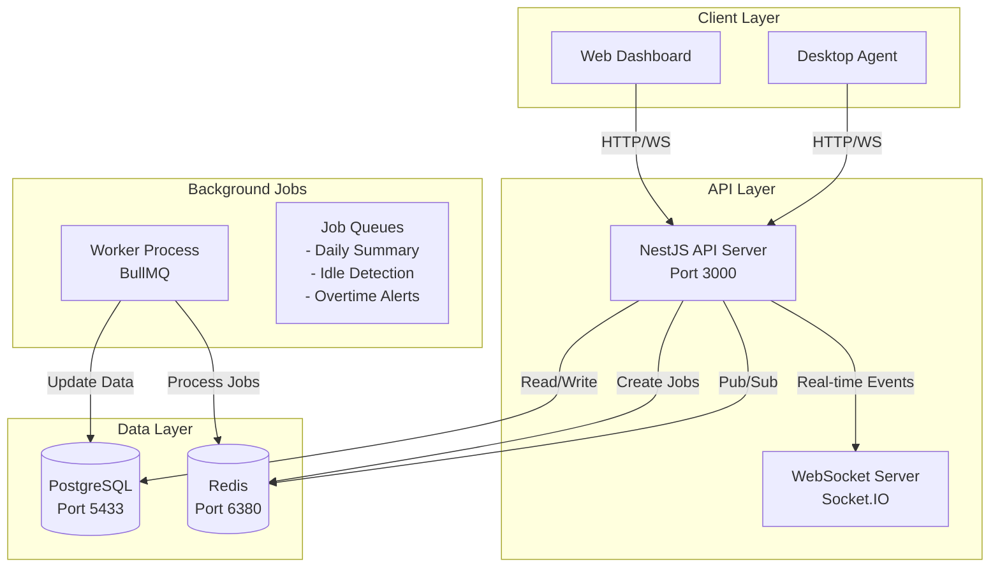

# WorkPulse - Project Architecture & Documentation

## Table of Contents
1. [Project Overview](#project-overview)
2. [Architecture](#architecture)
3. [Technology Stack](#technology-stack)
4. [Features & Functionality](#features--functionality)
5. [Database Schema](#database-schema)
6. [Project Structure](#project-structure)
7. [How It Works](#how-it-works)

---

## Project Overview

**WorkPulse** is a production-ready SaaS employee monitoring platform that tracks work sessions, activity logs, and provides real-time insights into employee productivity.

### Key Capabilities:
- ✅ Multi-tenant architecture (multiple organizations)
- ✅ Real-time work session tracking
- ✅ Activity logging with idle/active detection
- ✅ WebSocket-based real-time updates
- ✅ Background job processing for analytics
- ✅ Concurrency-safe session updates (optimistic locking)
- ✅ JWT-based authentication with role-based access control

---

## Architecture



### Design Patterns Used:
1. **Repository Pattern**: Data access abstraction via TypeORM
2. **Dependency Injection**: NestJS built-in DI container
3. **Optimistic Locking**: Version-based concurrency control for sessions
4. **Event-Driven**: WebSocket events for real-time updates
5. **Queue-Based Processing**: BullMQ for background jobs

---

## Technology Stack

### Core Framework
| Tool | Version | Purpose |
|------|---------|---------|
| **NestJS** | 10.x | Backend framework (TypeScript, modular architecture) |
| **TypeScript** | 5.x | Type-safe JavaScript |
| **Node.js** | 20.x | Runtime environment |

### Database & ORM
| Tool | Version | Purpose |
|------|---------|---------|
| **PostgreSQL** | 16 | Primary relational database |
| **TypeORM** | 0.3.x | ORM for database operations & migrations |
| **Redis** | 7 | Caching, job queues, presence tracking |

### Real-time & Jobs
| Tool | Version | Purpose |
|------|---------|---------|
| **Socket.IO** | 4.x | WebSocket server for real-time events |
| **BullMQ** | 5.x | Job queue system for background processing |

### Authentication & Security
| Tool | Version | Purpose |
|------|---------|---------|
| **JWT** | 10.x | Token-based authentication |
| **Passport** | 0.7.x | Authentication middleware |
| **bcrypt** | 5.x | Password hashing |

### DevOps & Infrastructure
| Tool | Version | Purpose |
|------|---------|---------|
| **Docker** | Latest | Containerization |
| **Docker Compose** | v2 | Multi-container orchestration |

### Logging & Monitoring
| Tool | Version | Purpose |
|------|---------|---------|
| **Pino** | 8.x | Structured JSON logging |
| **@nestjs/terminus** | 10.x | Health checks |

---

## Features & Functionality

### 1. Authentication & Authorization
**Purpose**: Secure user access with role-based permissions

**Features**:
- User registration with email/password
- JWT token-based authentication
- Role-based access control (Admin, Manager, Employee)
- Multi-tenant isolation (organization-level)

**How it works**:
1. User registers with organization ID
2. Password is hashed using bcrypt (12 rounds)
3. JWT token is generated with user ID, email, role, organization ID
4. Token is validated on every protected request
5. Guards check user roles for authorization

### 2. Work Session Management
**Purpose**: Track when employees start/stop work

**Features**:
- Start/stop work sessions
- Automatic session tracking
- Project association (optional)
- Optimistic locking to prevent data corruption

**How it works**:
1. User starts session → creates record in `work_sessions` table
2. Session has `version` column for optimistic locking
3. Activity updates increment version
4. If version mismatch detected → retry with latest data
5. Prevents double-counting when multiple requests update same session

**Optimistic Locking Example**:
```typescript
// Request 1 reads version 1, updates to version 2
// Request 2 reads version 1, tries to update → FAILS (version mismatch)
// Request 2 retries with version 2 → SUCCESS
```

### 3. Activity Logging
**Purpose**: Track what employees are doing during work sessions

**Features**:
- Log individual activities (active/idle)
- Batch activity logging for desktop agents
- Track application names and URLs
- Automatic session total updates

**How it works**:
1. Desktop agent sends activity data every 60 seconds
2. API validates session exists and is active
3. Creates `activity_logs` record
4. Updates session `total_active_seconds` or `total_idle_seconds`
5. Uses optimistic locking to prevent race conditions

### 4. Real-time Updates (WebSocket)
**Purpose**: Push live updates to connected clients

**Features**:
- User online/offline status
- Session updates
- Idle alerts (>5 minutes inactive)
- Overtime alerts (>9 hours worked)

**How it works**:
1. Client connects to WebSocket with JWT token
2. Server authenticates and joins user to organization room
3. Events are emitted to specific rooms (organization-wide or user-specific)
4. Redis tracks online users for presence

**Event Flow**:
```
User connects → Emit USER_ONLINE to organization room
Session updated → Emit SESSION_UPDATE to user room
User idle 5min → Emit INACTIVE_ALERT to managers
```

### 5. Background Jobs
**Purpose**: Process heavy tasks asynchronously

**Features**:
- **Daily Summary Generator**: Aggregates daily work stats
- **Idle Detector**: Checks for inactive sessions every minute
- **Overtime Checker**: Alerts when employees work >9 hours

**How it works**:
1. Jobs are added to Redis queues via BullMQ
2. Worker process picks up jobs from queue
3. Executes job logic (e.g., calculate daily summary)
4. Updates database with results
5. Emits WebSocket events if needed

**Job Schedule**:
- Idle Detector: Every 1 minute
- Overtime Checker: Every 30 minutes
- Daily Summary: Daily at midnight

### 6. Daily Summaries
**Purpose**: Aggregate daily productivity metrics

**Features**:
- Total work time per day
- Active vs idle time breakdown
- Productivity score calculation
- Historical tracking

**How it works**:
1. Background job runs at midnight
2. Queries all sessions for previous day
3. Aggregates `total_active_seconds` and `total_idle_seconds`
4. Calculates productivity score: `(active / total) * 100`
5. Stores in `daily_summaries` table

### 7. Alerts System
**Purpose**: Notify managers of important events

**Features**:
- Idle alerts (employee inactive >5 minutes)
- Overtime alerts (employee worked >9 hours)
- Alert resolution tracking

**How it works**:
1. Background jobs detect alert conditions
2. Create record in `alerts` table
3. Emit WebSocket event to managers
4. Managers can mark alerts as resolved

---

## Database Schema

### Tables (7 total)

#### 1. `organizations`
Stores company/organization data
```sql
- id (uuid, PK)
- name (varchar)
- plan_type (varchar) - e.g., "free", "premium"
- created_at (timestamp)
```

#### 2. `users`
Employee accounts
```sql
- id (uuid, PK)
- organization_id (uuid, FK)
- email (varchar, unique per org)
- password_hash (varchar)
- name (varchar)
- role (enum: admin, manager, employee)
- status (enum: active, inactive, suspended)
- last_seen (timestamp)
- created_at (timestamp)
```

#### 3. `projects`
Optional project tracking
```sql
- id (uuid, PK)
- organization_id (uuid, FK)
- name (varchar)
- description (text)
- created_by (uuid, FK to users)
- created_at (timestamp)
```

#### 4. `work_sessions`
Work time tracking
```sql
- id (uuid, PK)
- organization_id (uuid, FK)
- user_id (uuid, FK)
- project_id (uuid, FK, nullable)
- start_time (timestamp)
- end_time (timestamp, nullable)
- total_active_seconds (int)
- total_idle_seconds (int)
- status (enum: active, stopped)
- last_activity_at (timestamp)
- version (int) - for optimistic locking
- created_at (timestamp)
```

#### 5. `activity_logs`
Detailed activity records
```sql
- id (uuid, PK)
- session_id (uuid, FK)
- timestamp (timestamp)
- activity_type (enum: active, idle)
- duration_seconds (int)
- app_name (varchar, nullable)
- url (text, nullable)
```

#### 6. `daily_summaries`
Daily aggregated stats
```sql
- id (uuid, PK)
- organization_id (uuid, FK)
- user_id (uuid, FK)
- date (date, unique per user)
- total_work_seconds (int)
- active_seconds (int)
- idle_seconds (int)
- productivity_score (decimal)
- created_at (timestamp)
```

#### 7. `alerts`
System alerts
```sql
- id (uuid, PK)
- user_id (uuid, FK)
- type (enum: idle, overtime)
- message (text)
- created_at (timestamp)
- resolved_at (timestamp, nullable)
```

### Relationships:
```
organizations (1) ──→ (N) users
organizations (1) ──→ (N) projects
organizations (1) ──→ (N) work_sessions
organizations (1) ──→ (N) daily_summaries

users (1) ──→ (N) work_sessions
users (1) ──→ (N) daily_summaries
users (1) ──→ (N) alerts

projects (1) ──→ (N) work_sessions

work_sessions (1) ──→ (N) activity_logs
```

---

## Project Structure

```
workpulse/
├── src/
│   ├── main.ts                    # Application entry point
│   ├── app.module.ts              # Root module
│   │
│   ├── config/                    # Configuration files
│   │   ├── typeorm.config.ts      # Database configuration
│   │   └── logger.config.ts       # Pino logger setup
│   │
│   ├── common/                    # Shared utilities
│   │   ├── enums.ts               # Centralized enums
│   │   ├── decorators/            # Custom decorators
│   │   ├── filters/               # Exception filters
│   │   └── guards/                # Auth guards
│   │
│   ├── entities/                  # TypeORM entities (database models)
│   │   ├── organization.entity.ts
│   │   ├── user.entity.ts
│   │   ├── project.entity.ts
│   │   ├── work-session.entity.ts
│   │   ├── activity-log.entity.ts
│   │   ├── daily-summary.entity.ts
│   │   └── alert.entity.ts
│   │
│   ├── modules/                   # Feature modules
│   │   ├── auth/                  # Authentication
│   │   │   ├── auth.module.ts
│   │   │   ├── auth.service.ts
│   │   │   ├── auth.controller.ts
│   │   │   ├── strategies/        # Passport strategies
│   │   │   └── dto/               # Data transfer objects
│   │   │
│   │   ├── sessions/              # Work session management
│   │   │   ├── sessions.module.ts
│   │   │   ├── sessions.service.ts
│   │   │   ├── sessions.controller.ts
│   │   │   └── dto/
│   │   │
│   │   ├── activity/              # Activity logging
│   │   │   ├── activity.module.ts
│   │   │   ├── activity.service.ts
│   │   │   ├── activity.controller.ts
│   │   │   └── dto/
│   │   │
│   │   ├── websocket/             # Real-time events
│   │   │   ├── websocket.module.ts
│   │   │   ├── websocket.gateway.ts
│   │   │   └── websocket.service.ts
│   │   │
│   │   └── health/                # Health checks
│   │       ├── health.module.ts
│   │       └── health.controller.ts
│   │
│   ├── jobs/                      # Background job processors
│   │   ├── daily-summary.processor.ts
│   │   ├── idle-detector.processor.ts
│   │   └── overtime-checker.processor.ts
│   │
│   ├── migrations/                # Database migrations
│   │   └── 1707000000000-InitialSchema.ts
│   │
│   └── worker.ts                  # Worker process entry point
│
├── test/                          # Test files
│   └── test-activity-load.js      # Concurrency load test
│
├── docs/                          # Documentation
│   ├── API.md                     # API reference
│   ├── LAN_SETUP.md               # LAN setup guide
│   └── ARCHITECTURE.md            # This file
│
├── docker-compose.yml             # Docker orchestration
├── Dockerfile                     # Container image
├── package.json                   # Dependencies
├── tsconfig.json                  # TypeScript config
└── .env                           # Environment variables
```

---

## How It Works

### Complete Flow Example: Employee Starts Work

1. **Desktop Agent Starts**
   ```
   Desktop Agent → POST /auth/login
   ← JWT token
   ```

2. **Start Work Session**
   ```
   Desktop Agent → POST /sessions/start
   API creates session in database (status: active)
   API emits SESSION_UPDATE via WebSocket
   ← Session ID
   ```

3. **Log Activities (every 60 seconds)**
   ```
   Desktop Agent → POST /sessions/:id/activity
   {
     activityType: "active",
     durationSeconds: 60,
     appName: "VS Code"
   }
   
   API:
   1. Validates session exists
   2. Creates activity_log record
   3. Updates session.total_active_seconds
   4. Uses optimistic locking (version check)
   5. Emits SESSION_UPDATE via WebSocket
   ```

4. **Background Jobs Running**
   ```
   Every 1 minute:
   - Idle Detector checks last_activity_at
   - If >5 minutes → Create alert, emit INACTIVE_ALERT
   
   Every 30 minutes:
   - Overtime Checker calculates total work time
   - If >9 hours → Create alert, emit OVERTIME_ALERT
   
   Daily at midnight:
   - Daily Summary aggregates previous day
   - Calculates productivity score
   - Stores in daily_summaries table
   ```

5. **End Work Session**
   ```
   Desktop Agent → POST /sessions/:id/stop
   API updates session (status: stopped, end_time: now)
   API emits SESSION_UPDATE via WebSocket
   ```

6. **Manager Views Dashboard**
   ```
   Web Dashboard connects via WebSocket
   Receives real-time updates:
   - USER_ONLINE/OFFLINE
   - SESSION_UPDATE
   - INACTIVE_ALERT
   - OVERTIME_ALERT
   ```

---

## Performance Optimizations

1. **Optimistic Locking**: Prevents data corruption with concurrent updates
2. **Database Indexing**: Indexes on frequently queried columns
3. **Redis Caching**: Online user presence tracking
4. **Background Jobs**: Heavy processing offloaded to worker
5. **Connection Pooling**: TypeORM manages database connections

---

## Security Features

1. **Password Hashing**: bcrypt with 12 rounds
2. **JWT Tokens**: Signed with secret, 7-day expiration
3. **Role-Based Access**: Guards check user roles
4. **Multi-Tenant Isolation**: Organization-level data separation
5. **Input Validation**: DTOs with class-validator
6. **SQL Injection Prevention**: TypeORM parameterized queries

---

## Scalability Considerations

### Current Setup (Single Server):
- Handles ~1000 concurrent users
- ~10,000 activity logs per minute

### To Scale Horizontally:
1. **API Servers**: Add load balancer, run multiple API instances
2. **Database**: Use PostgreSQL replication (read replicas)
3. **Redis**: Use Redis Cluster for distributed caching
4. **Workers**: Run multiple worker processes
5. **WebSocket**: Use Redis adapter for Socket.IO clustering

---

## Monitoring & Debugging

### Health Check:
```bash
curl http://localhost:3000/health
```

### Logs:
```bash
# API logs
docker logs workpulse_api -f

# Worker logs
docker logs workpulse_worker -f

# Database logs
docker logs workpulse_postgres -f
```

### Database Queries:
```bash
docker exec -it workpulse_postgres psql -U workpulse -d workpulse_db

# Check active sessions
SELECT * FROM work_sessions WHERE status = 'active';

# Check recent activities
SELECT * FROM activity_logs ORDER BY timestamp DESC LIMIT 10;
```

---

## Future Enhancements

- [ ] Screenshots/screen recording
- [ ] Productivity analytics dashboard
- [ ] Team collaboration features
- [ ] Mobile app support
- [ ] Advanced reporting (PDF exports)
- [ ] Integration with project management tools
- [ ] AI-powered productivity insights
